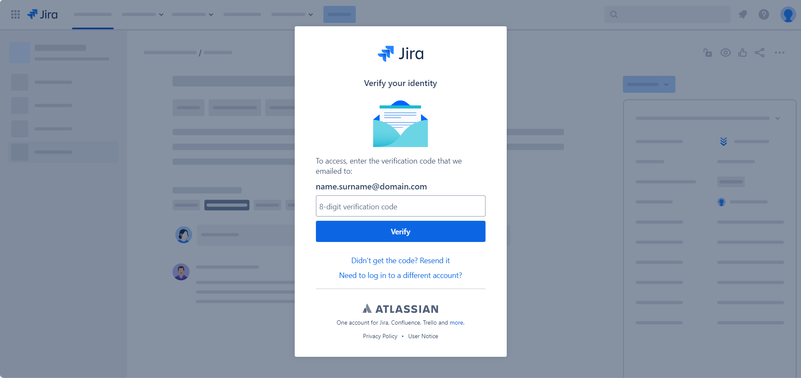
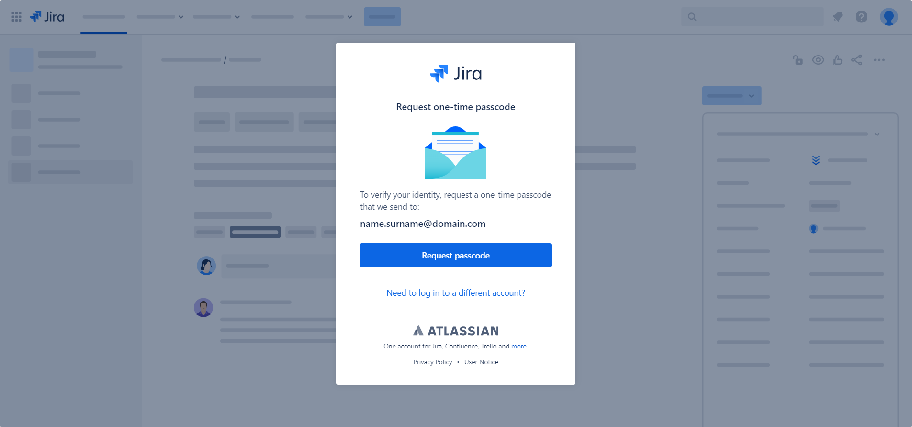

# Jira Confluence decode and reload

A simple Chrome, Edge and Brave (Firefox support coming soon) browser extension to reload Jira and Confluence pages with request one-time passcode modal after successful verification.

# Installation

1. Clone this repo
2. Open the browser and go to Extensions and Manage Extensions or navigate to

    Chrome: `chrome://extensions`

    Edge: `edge://extensions`

    Brave: `brave://extensions`

3. Enable Developer mode
4. Load unpacked
5. Select extension folder
6. Pin extension for easy access

# Info

## TL;DR

Once you verified your identity, reload all other tabs with the "request one-time passcode" modal to avoid receiving and entering a new verification code for every open tab.

## Current flow

Depending on your organization's Atlassian security and access policies, more precisely the [session expiration](https://support.atlassian.com/security-and-access-policies/docs/update-verification-frequency/), Atlassian will expire your session and force you to [verify your identity](https://support.atlassian.com/atlassian-account/docs/verify-your-identity/) to access Jira and Confluence again by sending you an email with a six-digit verification code. A session can be between 15 minutes and 30 days long.

Once the session has expired, you will be prompted with a similar screen and an email with the new verification code will be sent automatically

However, if you have multiple Jira/Confluence tabs open, even after verifying your identity, all other tabs will still request a one-time passcode

Requesting a new passcode or reloading the page will redirect you to the verification page again and force you to enter a new verification code.

With this extension, once you verify your identity, on all the pages with the one-time passcode modal, you just have to click the extension icon, the page will reload and you are good to go.

# Credits

Atlassian logo from [Atlassian Design System](https://atlassian.design/foundations/logos) and [reload icon created by mavadee - Flaticon](https://www.flaticon.com/free-icons/reload).

# Disclaimer

We are not affiliated, associated, authorized, endorsed by, or in any way officially connected with Atlassian, or any of its subsidiaries or its affiliates.
